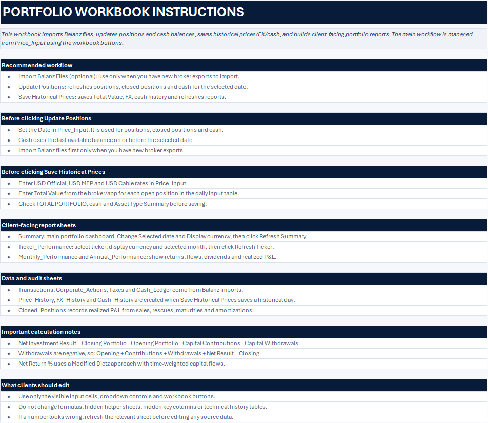
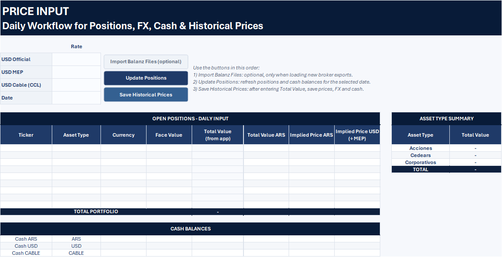
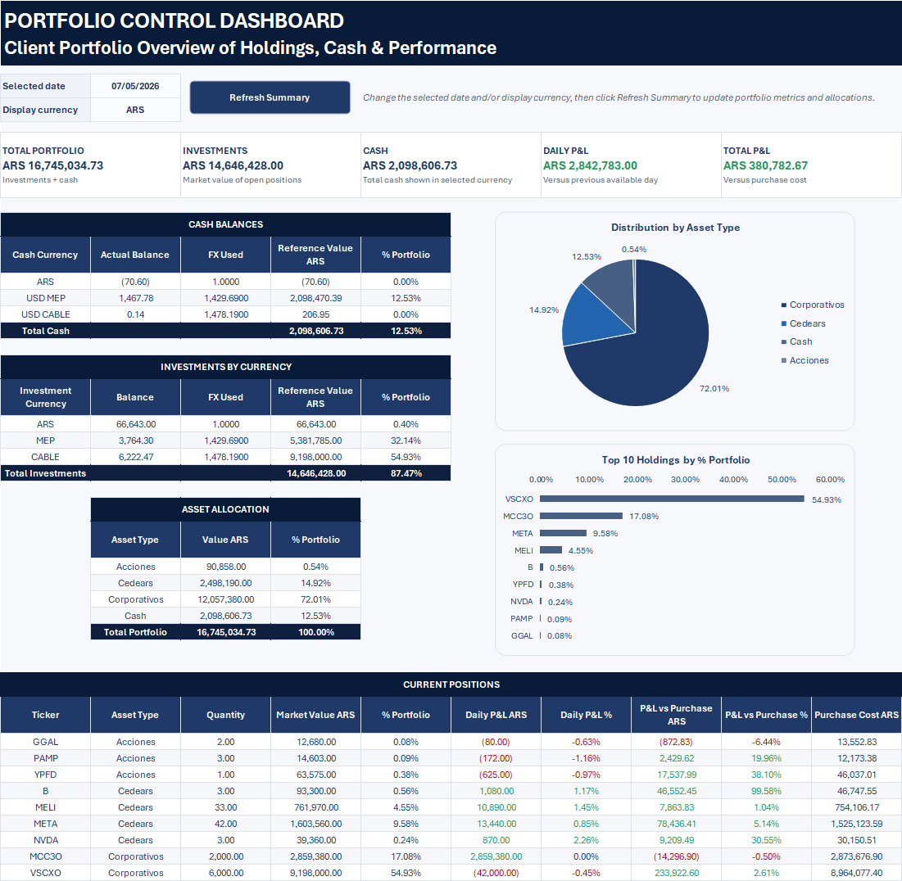
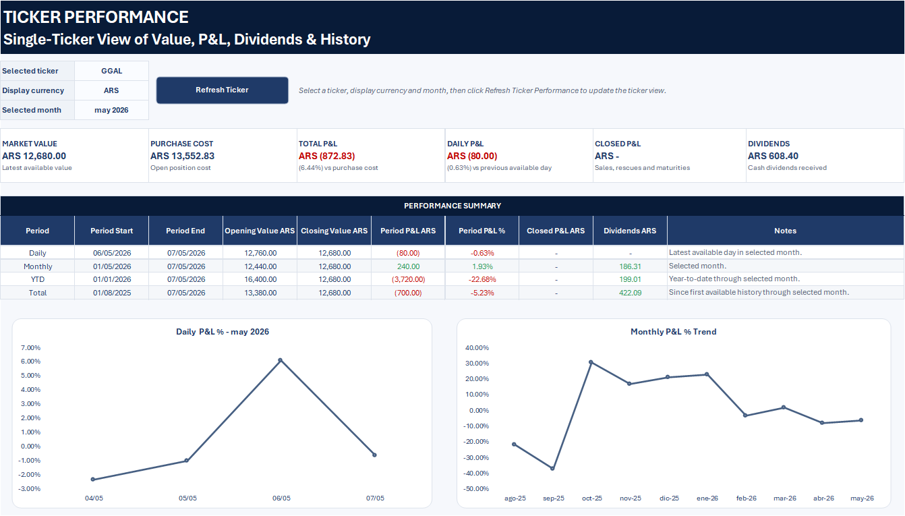
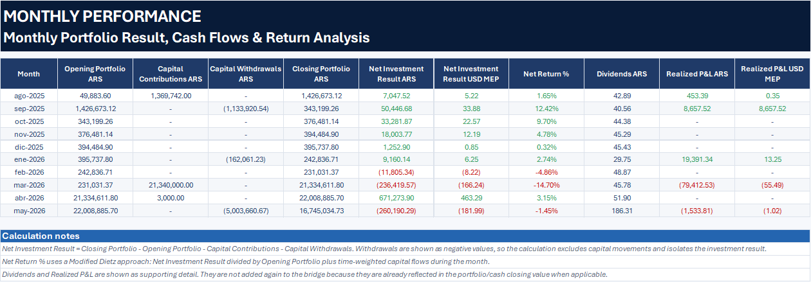
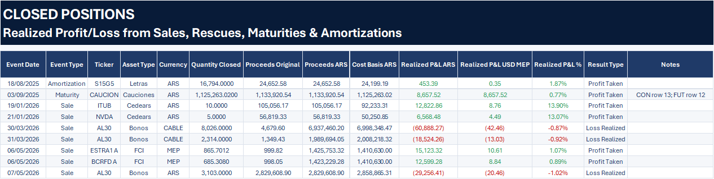

# Excel Portfolio Tracker Demo

Macro-free demo workbook for a portfolio tracker originally built in Excel.

This repository includes an anonymized `.xlsx` version of the workbook so the structure, dashboards, reports, and financial tracking layout can be reviewed without exposing the VBA automation code.

## Download

[Download the demo workbook](Portfolio_Tracker_Demo.xlsx)

## Screenshots

### Portfolio Instructions

### Daily Input Workflow

### Portfolio Dashboard

### Ticker Performance Report

### Monthly Performance Report

### Closed Positions Report

## What It Shows

- Portfolio summary dashboard
- Daily workflow for positions, FX, cash, and historical prices
- Single-ticker performance view
- Monthly performance reporting
- Closed positions and realized P&L reporting
- Cash, transactions, taxes, and corporate actions logs
- Anonymized sample data
- Macro-free workbook structure for review

## Notes

The production version includes VBA automation for importing broker files, updating positions, saving historical prices, refreshing dashboards, and generating reports.

This public demo intentionally excludes macros and source code.
